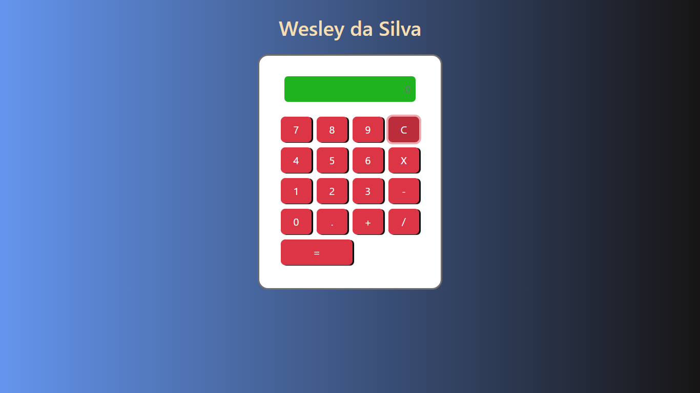

# Projeto calculadora

## Meu primeiro projeto pessoal no mundo da programação.
---
## Ideias iniciais:
- Conhecer a lógica de programação com Javascript
- Modelar o css de um forma bem simples.
- Utilizar algumas funcionalidades com bootstrap.
---
## Tecnologias Utilizadas:
- HTML
- CSS
- BOOTSTRAP
- JAVASCRIPT
